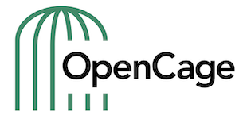

# address formatting

### Overview

This project contains templates and test cases for address formats used in territories around the world. The templates can then be processed in any programming language ([see below for list of processors](#processing-logic)).

### Build Status

### An example:

Given a set of address parts like

     house_number:  17
     road:          Rue du Médecin-Colonel Calbairac
     neighbourhood: Lafourguette
     suburb:        Toulouse Ouest
     postcode:      31000
     city:          Toulouse
     county:        Toulouse
     state:         Midi-Pyrénées
     country:       France
     country_code:  FR

we want to write logic to compile an address in the format consumers expect

    17 Rue du Médecin-Colonel Calbairac
    31000 Toulouse
    France

### Why would you want to do this?

The intended use case is database or geocoding systems (forward, reverse, autocomplete) where we know both the country of the address and the language of the user/reader. The address is displayed to a consumer (for example in an app) and not used to print on an envelope for actual postal delivery. We use it to format output from the [OpenCage Geocoding API](https://opencagedata.com/api).

### Which addresses are we talking about?

We have to deal with

   * incomplete data
   * anything with a name (peaks, bridges, bus stops)

Unlike [physical post (office) mail](http://www.bitboost.com/ref/international-address-formats.html) we don't have to deal with

   * apartment/flat number, floor numbers
   * PO boxes
   * translating the language of the (destination) address. Whatever language is input is output. 
  
### Processing logic

Our goal with this repository is a series of (programming) language independent templates. Those templates can then be processed by whatever software you like. 

There are open-source implementations in

  * [Android library](https://github.com/woheller69/AndroidAddressFormatter)
  * [Elixir](https://github.com/dkuku/ex_address_formatting)
  * [Go](https://github.com/timonmasberg/address-formatter)
  * [Java](https://github.com/placemarkt/address-formatter-java)
  * [Javascript](https://github.com/fragaria/address-formatter)
  * [Perl](https://metacpan.org/release/Geo-Address-Formatter)
  * [PHP](https://github.com/predicthq/address-formatter-php)
  * [Python](https://github.com/dunkelstern/international_address_formatter)
  * [Ruby](https://github.com/mirubiri/address_composer)
  * [Rust](https://github.com/CanalTP/address-formatter-rs)
  * [Scala](https://github.com/ben-willis/address-formatter)

We would love more language implementations. The more people who use the templates, the more likely bugs will be reported. 
If you write a processor, please submit a pull request adding it to the list. Thanks. 

### International coverage

As of `Sun 17 Feb 2019` coverage is:

    We are aware of 248 territories
    We have tests for 248 (100%) territories
    We have rules for 248 (100%) territories
    0 (0%) territories have neither rules nor tests
    
This output is generated by `bin/coverage.pl`    

We need more language specific abbreviations. Please see `conf/abbreviations`. Pull requests gladly received. 

A detailed breakdown of test and configuration coverage can be found by running `bin/coverage.pl -d`. A list of all known territories is in `conf/country_codes.yaml`

_Please note: the list is simple all officially assigned [ISO 3166-1 alpha-2 codes](https://en.wikipedia.org/wiki/ISO_3166-1_alpha-2#Officially_assigned_code_elements), and is not a political statement on whether or not these territories are or are not or should or should not be political states._

### File format

The files are in [YAML](http://yaml.org/) format. The templates are written in [Mustache](http://mustache.github.io/). Both formats are human readable, strict, solve escaping and support comments. YAML allows references (called "ankers") to avoid copy&paste, Mustache allows sub-templates (called "partials").

### How to add your country/territory

1. edit the .yaml testcase for the country/territory in `testcases/countries`. The file names correspond to the appropriate ISO 3166-1 alpha-2 code - see `conf/country_codes.yaml`
  * a good way to get sample data is:
      * find an addressed location (house, business, etc) in your
        target territory in OpenStreetMap
      * get the coordinates (lat, long) of the location
      * put the coordinates into the [OpenCage Geocoding API demo page](https://opencagedata.com/demo)
      * look at the resulting JSON in the *Raw Response* tab

2. edit `conf/countries/worldwide.yaml`
  * Possibly your country/territory uses an existing generic format as
    defined at the top of the file. If so, great, just map you
    country_code to the generic template. You may still want to add
    clean up code (see the entry for `DE` as an example).
  * If not you need to define a new generic rule set
      * possibly you will need to define new state/region mappings in `conf/state_codes.yaml`

3. to test you will now need to process the .yaml test via a processer
   (see above) and ensure the input leads to the desired output.

If in doubt, please get in touch by submitting an issue. 

### Formatting rules

Currently we support the following formatting rules:

* `replace:` regex that operates on the input values, useful for removing bureaucratic cruft like "London Borough of ". Note if you define the regex starting with format _X=_, for example _city=_ it should operate only on values with that key
* `postformat_replace:` regex that operates on the final output
* `add_component:` with a value of the form `component=XXXX`
* `change_country:` change the country value of the input, useful for dependent territories. Can include a substitution like `$state` so that that component value is then inserted into the new country value. See `testcases/countries/sh.yaml` for an example.
* `use_country:` use the formating configuration of another country, useful for dependent territories to avoid duplicating configuration

### The future

More tests! For every rule about addresses there are exceptions and edge cases to consider. More test cases are always needed.

Planned features:

  * basic error checking, for example ignore things which obviously can not be postcodes
  * define rules for postcode format specifically

We welcome your pull requests. Together we can address the world!

### License

This project is licensed under the MIT License - see the [LICENSE.txt](LICENSE.txt) file for details

### Further reading on the challenge of address

Here's [our blog post anouncing this project](https://blog.opencagedata.com/post/99059889253/good-looking-addresses-solving-the-berlin-berlin) and the motivations behind it.

You may enjoy Michael Tandy's [Falsehoods Programmers Believe about Addresses](http://www.mjt.me.uk/posts/falsehoods-programmers-believe-about-addresses/).

If it's actual address data you're after, check out [OpenStreetMap](https://www.openstreetmap.org) and [OpenAddresses](http://openaddresses.io/).

If you want to turn longitude, latitude into well formatted addresses or placenames, well that's what a geocoder does. Check out ours: [OpenCage Geocoder](https://opencagedata.com).

If all this convinces you that address are evil, please check out [what3words](http://what3words.com) which allows you to dispense with them entirely. 

### Who is OpenCage GmbH?

We run a worldwide [geocoding API](https://opencagedata.com/api) and [geosearch](https://opencagedata.com/geosearch) service based on open data. 
Learn more [about us](https://opencagedata.com/about). 

We also organize [Geomob](https://thegeomob.com), a series of regular meetups for location based service creators, where we do our best to highlight geoinnovation. If you like geo stuff, you will probably enjoy [the Geomob podcast](https://thegeomob.com/podcast/).

